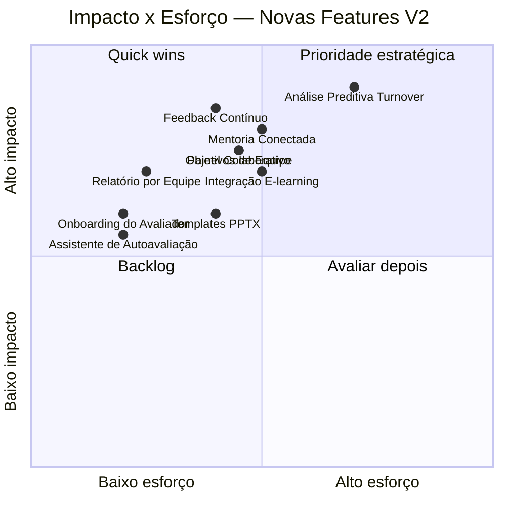

# ECK V2 — 10 Novas Features de Produto (Foco no Cliente)

> **Documento de inovação de produto** · julho/2026  
> **Público:** ECK Consulting (produto, comercial, engenharia)  
> **Contexto:** V1 é o primeiro entregável e está em produção. Estas são funcionalidades novas para ampliar o valor percebido pelo cliente, sem dar sensação de produto incompleto ou correção de lacunas.

---

## Resumo Executivo

| # | Feature | Pilar | Impacto | Esforço | Receita |
|---|---------|-------|---------|---------|---------|
| 1 | Mentoria Conectada por Competências | Desenvolvimento | Alto | Médio | Upsell consultoria |
| 2 | Integração com Plataformas de E-learning | Desenvolvimento | Alto | Médio | Enterprise |
| 3 | Programa de Onboarding do Avaliador | Experiência | Médio | Baixo | Qualidade do dado |
| 4 | Painel Colaborativo de Decisões | Tomada de decisão | Alto | Médio | Retenção |
| 5 | Objetivos de Equipe Compartilhados | Desenvolvimento | Alto | Médio | Receita recorrente |
| 6 | Templates de Apresentação Executiva (PPTX) | Entrega de valor | Médio | Médio | Diferencial comercial |
| 7 | Feedback Contínuo (Pós-ciclo, Avaliado × Gestor) | Desenvolvimento | Muito alto | Médio | Retenção |
| 8 | Relatório de Feedback por Equipe | Tomada de decisão | Alto | Baixo | Upsell |
| 9 | Análise Preditiva de Turnover por Padrão de Feedback | Analytics avançado | Muito alto | Alto | Premium |
| 10 | Assistente de Autoavaliação Guiada | Experiência | Médio | Baixo | Qualidade do dado |

---

## Pilar A — Experiência do Participante

### 1. Programa de Onboarding do Avaliador

**O quê:** Experiência guiada de ~3 minutos apresentada ao avaliador antes de iniciar o questionário:

- O que é avaliação 360° e por que importa (vídeo curto ou slides interativos).
- Vieses cognitivos comuns (efeito halo, viés de recência, tendenciosidade central) com exemplos práticos.
- Comparação entre feedback útil vs. feedback genérico ("ótimo" vs. "escuta a equipe em reuniões e sintetiza pontos-chave").
- Confirmação de consentimento e compromisso de qualidade.

**Por que:** A qualidade do feedback nasce na origem. Avaliadores mal orientados entregam respostas genéricas que comprometem toda a análise. Programa de onboarding reduz vieses antes da coleta, complementando a calibração pós-coleta.

**Base técnica:** Survey.js com página inicial customizada + módulo onboarding em `assessmentLinks` (flag `onboardingCompleted`).

**Entrega mínima:** Wizard de 3 telas antes do survey + flag no link de avaliação + taxa de conclusão de onboarding no dashboard.

---

### 2. Assistente de Autoavaliação Guiada

**O quê:** Durante a autoavaliação, o sistema orienta o avaliado com prompts reflexivos por competência:

- Antes de cada competência: "Pense em uma situação recente onde você demonstrou [competência]. O que você fez?"
- Comparação com descritores do nível atual vs. esperado (baseado em `competencyGroups`).
- Resumo visual do perfil em formação ao final ("seu perfil está se formando") antes do envio.

**Por que:** Autoavaliação é o momento de maior viés (geralmente sobreestimado). Guiar com reflexão estruturada melhora a honestidade do autoconhecimento e torna o gap autoavaliação × avaliadores um insight verdadeiramente útil.

**Base técnica:** `competencyGroups` com descritores por nível + Survey.js com lógica condicional + prompts inline.

**Entrega mínima:** Modo "autoavaliação guiada" no survey + descritores visíveis ao lado de cada item + resumo pré-envio.

---

## Pilar B — Desenvolvimento Contínuo de Pessoas

### 3. Mentoria Conectada por Competências

**O quê:** Após a publicação dos relatórios, o sistema sugere **pareamentos de mentoria** dentro da organização:

- Identifica avaliados com gap na competência X.
- Sugere mentores com score alto na mesma competência X (dentro do mesmo cliente).
- Dashboard de "rede de mentoria": quem ensina o quê, quem precisa de apoio em quê.
- Opcional: match automático com notificação para gestor aprovar.

**Por que:** O 360° identifica gaps, mas quem desenvolve? Esta feature transforma dados em ação concreta de desenvolvimento organizacional, aproveitando o capital humano interno sem custo externo. Fecha o loop mais poderoso para RH: diagnóstico → ação → evolução mensurável.

**Base técnico:** Agregação de scores por participante em `releasedReports` + matching por `competencyGroups` + Coleção `mentorshipPairs` opcional.

**Entrega mínima:** Aba "Mentoria Sugerida" no dashboard do projeto + export de lista de pares com justificativa (competência X: gap de 0.8 pts).

---

### 4. Feedback Contínuo (Pós-ciclo, Avaliado × Gestor)

**O quê:** Após o ciclo de 360°, canal privado entre avaliado e gestor para **feedback assíncrono e contínuo**:

- Gestor e avaliado trocam notes vinculadas a competências específicas.
- Histórico de conversas visível na timeline do PDI (Plano de Desenvolvimento Individual).
- Check-ins periódicos sugeridos a cada 30/60/90 dias pós-ciclo ("como anda o desenvolvimento em [competência]?").
- Métrica de engajamento: "% de avaliados com feedback ativo", "% de check-ins completados".

**Por que:** O 360° não é um evento pontual — é o gatilho para um processo de desenvolvimento. Canal estruturado de feedback pós-ciclo mantém o cliente ativo na plataforma meses após o ciclo, aumentando retenção e justificando renovação. O gestor vê valor contínuo, não só um PDF.

**Base técnica:** Subcoleção `projects/{id}/feedbackThreads` + `viewer` e `admin_client` auth + push notifications.

**Entrega mínima:** Widget "Feedback Contínuo" no portal do gestor + campo por competência + notificação de check-in agendado.

---

### 5. Objetivos de Equipe Compartilhados

**O quê:** Após análise dos relatórios de um projeto, o RH ou gestor pode criar **objetivos coletivos** a partir das competências mais fraquezas identificadas:

- "Esta equipe terá foco em Comunicación e Gestão de Conflitos no próximo trimestre."
- Dashboard de progresso do objetivo compartilhado com check-ins individuais.
- each membro vê sua contribuição ao objetivo coletivo + evolução.
- Vinculação com PDI individual: objetivos pessoais alimentam o objetivo de equipe.

**Por que:** Desenvolvimento não é só individual — equipes com gaps similares precisam de intervenção coletiva. Criar objetivos compartilhados gera senso de propósito, accountability mútua, e visibilidade de progresso em nível de time, não apenas individual.

**Base técnica:** Agregação de gaps por projeto + Coleção `teamGoals` + vinculação com `participants` e PDIs.

**Entrega mínima:** Botão "Criar Objetivo de Equipe" na análise do projeto + campos: nome, competências alvo, prazo + dashboard de progresso com checklist individual.

---

### 6. Integração com Plataformas de E-learning

**O quê:** Conector que sincroniza competências e gaps identificados no 360° com plataformas LMS (Moodle, Cornerstone, Totvs Learning, SAP SuccessFactors Learning):

- Export de competências com lacunas → criação automática de plano de curso no LMS.
- Import de certificados/conclusão de cursos → atualização do perfil de desenvolvimento no ECK.
- "Se você precisa melhorar em Liderança Situacional, sugerimos 3 cursos disponíveis na sua plataforma."

**Por que:** Grandes empresas já têm investimento em LMS. Conectar 360° com formação existente elimina o silo entre "diagnóstico" e "plano de ação", tornando o ECK parte do ecossistema de desenvolvimento, não uma ferramenta isolada.

**Base técnica:** Webhooks configuráveis + API REST genérica por LMS + `competencyGroups` mapeados a keywords de busca.

**Entrega mínima:** Configuração de integração por cliente com endpoint do LMS + export CSV de gaps por participante + mapeamento competência → termos de busca de cursos.

---

## Pilar C — Tomada de Decisão por Comitês

### 7. Painel Colaborativo de Decisões

**O quê:** Espaço onde múltiplos membros do RH ou comité de calibragem acessam simultaneamente os dados agregados de um ciclo para discutir e tomar decisões:

- Visualização em tempo real dos resultados agregados (sem expor indivíduos).
- Área de anotações por competência ou por projeto ("notamos que 'Comunicação' tem score baixo em todas as áreas — vale revisar o modelo?").
- Status de decisão por competência: "a analisar", "aprovado como-isso", "requer revisão de peso".
- Histórico de decisões tomadas durante o ciclo para referência futura.

**Por que:** RH enterprise não publica relatórios sem comité de calibragem. Hoje esse processo é offline (planilhas, reuniões sem registro). Painel colaborativo traz transparência, rastreabilidade e eficiência para discussões que hoje levam dias.

**Base técnica:** `releasedReports` em modo agregado + Coleção `calibrationSessions` + anotações vinculadas a competências ou projetos.

**Entrega mínima:** Rota `/calibration` com acesso por convite + visualização agregada + área de notas por competência + export de ata de decisão.

---

### 8. Relatório de Feedback por Equipe

**O qué:** Além do relatório individual, gerar um relatório agregado por equipe ou departamento:

- Médias de competências por equipe, com comparativo entre equipes.
- Perfil coletivo: "a equipe de Vendas tem força em 'Orientação ao Cliente' e gap em 'Trabalho em Equipe'."
- Top pontos de feedback qualitativo (agregados e anonimizado).
- Recomendações de desenvolvimento por equipe (treinamento coletivo, mentorias cruzadas).
- Evolução histórica: "a equipe de Operações melhorou 0.3 pontos em Gestão de Tempo desde o último ciclo."

**Por que:** Gestores de área e RH precisam de visão de equipe, não só individual. "Meu time como um todo está onde precisa estar?" é a pergunta que o relatório individual não responde. abre upsell de relatório de equipe como produto adicional por crédito fracionado.

**Base técnica:** Agregação por `participants.team` ou `participants.department` + report templates configuráveis + pdfmake para export.

**Entrega mínima:** Botão "Gerar Relatório de Equipe" + dropdown de equipes + template de relatório agregado com radar de competências e qualitativos anonimizados.

---

### 9. Análise Preditiva de Turnover por Padrão de Feedback

**O quê:** Modelo estatístico que identifica **sinais de risco de turnover** com base em padrões de feedback:

- Gap significativo entre autoavaliação e avaliadores (geralmente indica desconexão com a organização).
- Deterioração entre ciclos ("o score em Engajamento caiu 1.2 pts").
- Feedback qualitativo com temas recorrentes negativos ("não vejo perspectiva", "falta reconhecimento").
- Score de risco por participante: baixo / médio / alto, com explicação transparente.
- Alerta proativo para gestor/RH: "3 profissionais com risco de turnover identificado no último ciclo."

**Por que:** Reduzir turnover é uma das maiores dores de RH. Se o ECK pode antecipar risco com base em dados que já coleta, vira ferramenta estratégica para reteniçao, não só diagnóstico de competência. Produto altamente diferenciável e defensável.

**Base técnica:** Scores de gap (auto vs outros), delta entre ciclos, análise de sentimentos em qualitativos + modelo scoring configurable no Firestore.

**Entrega mínima:** Aba "Risco de Turnover" no dashboard do projeto + score por participante com justificativa (gap, deterioração, temas negativos) + alerta para `admin_client` e `admin_master`.

---

## Pilar D — Diferencial Comercial

### 10. Templates de Apresentação Executiva (PPTX)

**O quê:** Geração automática de apresentações em PowerPoint (PPTX) a partir dos dados do relatório:

- Templates profissionais pré-desenhados (clean, corporativo, moderno).
- Slides: visão geral do ciclo, radar de competências, gaps identificados, qualitativos de destaque, recomendações.
- Um por avaliado individual ou um consolidado por projeto/equipe.
- Editável: o consultor abre o PPTX no PowerPoint e ajusta se necessário.

**Por que:** Consultores ECK entregam devolutivas em workshops presenciais ou reuniões com gestores. Hoje eles precisam recriar slides manualmente a partir dos dados do relatório. Gerar PPTX prontamente economiza horas de preparação, padroniza a entrega consultiva, e aumenta qualidade percebida pelo cliente final.

**Base técnica:** Biblioteca `pptxgenjs` + dados agregados de `reports` + `competencyGroups` para estruturar slides.

**Entrega mínima:** Botão "Exportar Apresentação (PPTX)" no relatório + template padrão com 8-10 slides + gráficos gerados a partir dos dados do avaliado ou do projeto.

---

## Mapa de Priorização

---

## Matriz de Impacto por Persona

| Feature | `admin_master` | `admin_client` | Gestor (`viewer`) | Avaliado | Avaliador |
|---------|:--------------:|:--------------:|:-----------------:|:--------:|:---------:|
| Onboarding do Avaliador | ✓ Painel métrica | ✓ Qualidade | — | — | ★★★★ |
| Assistente Autoavaliação | ✓ Dados melhores | ✓ | — | ★★★ | — |
| Mentoria Conectada | ✓ Upsell | ★★★ | ★★★ | ★★ | — |
| Feedback Contínuo | ✓ Retenção | ★★★ | ★★★ | ★★★ | — |
| Objetivos de Equipe | ✓ Receita | ★★★ | ★★★ | ★★ | — |
| Integração E-learning | ✓ Enterprise | ★★★ | ★★ | ★★ | — |
| Painel Colaborativo | — | ★★★★ | ★★★ | — | — |
| Relatório por Equipe | ✓ Upsell | ★★★★ | ★★★ | — | — |
| Análise Preditiva | ✓ Diferencial | ★★★★ | ★★ | — | — |
| Templates PPTX | ★★★★ | ★★★ | ★★ | — | — |

> ★★★★ = impacto direto principal · ★★★ = benefício significativo · ★★ = benefício secundário

---

## Considerações Finais

### O que isso NÃO é

- ❌ Correção de bugs ou lacunas do produto atual.
- ❌ Refatoração ou trabalho técnico invisível.
- ❌ Features que competem com funcionalidades já propostas no roadmap existente.

### O que isso é

- ✅ 10 funcionalidades novas, cada uma entregando valor mensurável para o cliente final.
- ✅ Cobertura de personas: avaliador, avaliado, gestor, RH, e consultor ECK.
- ✅ Mix de quick wins (onboarding, assistente, relatório por equipe) com features estratégicas (preditiva, feedback contínuo, mentoria).
- ✅ Cada feature com base técnica já existente (Firestore, Survey.js, pdfmake, ECharts) — nada que exija substituir a stack.

### Próximos Passos

1. Validar com 2-3 clientes ativos quais features gerariam "wow" (especialmente **Painel Colaborativo**, **Análise Preditiva** e **Mentoria Conectada**).
2. Definir precificação e modelo de crédito para features premium (preditiva, mentoria, integração LMS).
3. Escolher 2-3 para detalhar como épicos no backlog técnico considerando dependências e esforço.

---

*Documento baseado na arquitetura atual do ECK: Angular 18, Firebase Firestore + Cloud Functions, Survey.js, pdfmake, ECharts, GrapesJS, e modelo de dados multi-tenant existente.*
