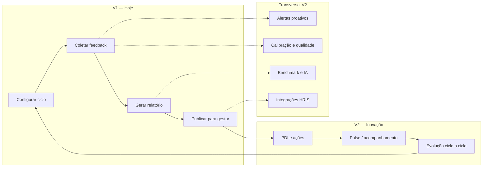

# ECK 360° — Features Inovadoras para a V2

> **Documento estratégico de produto** · julho/2026  
> **Público:** ECK Consulting (produto, comercial, engenharia)  
> **Contexto:** O ECK v1 está operacional e em produção. Este documento define **para onde evoluir** sem descartar o que já funciona.

---

## Sumário

1. [O que o ECK é de verdade](#1-o-que-o-eck-é-de-verdade)
2. [O que a V1 já entrega (baseline)](#2-o-que-a-v1-já-entrega-baseline)
3. [Tese da V2](#3-tese-da-v2)
4. [Features inovadoras por pilar](#4-features-inovadoras-por-pilar)
5. [Matriz de priorização](#5-matriz-de-priorização)
6. [Modelo de monetização V2](#6-modelo-de-monetização-v2)
7. [O que não fazer na V2](#7-o-que-não-fazer-na-v2)
8. [Roadmap sugerido (4 trimestres)](#8-roadmap-sugerido-4-trimestres)

---

## 1. O que o ECK é de verdade

O **ECK (Evaluation Competency Kit)** não é um “Typeform de RH” nem um LMS. É a **infraestrutura operacional da ECK Consulting** para rodar ciclos de **avaliação 360° multi-rater** em clientes corporativos (B2B multi-tenant).

### Problema que resolve

Consultorias e RHs corporativos precisam:

1. **Desenhar** o que será medido (competências, perguntas, categorias de avaliadores).
2. **Operar** o ciclo (convites, lembretes, prazos, créditos, bloqueios).
3. **Coletar** respostas com rastreabilidade (tokens, links, status).
4. **Interpretar** dados (gap self vs outros, Johari, destaques, abertas).
5. **Entregar** devolutivas (PDF/DOCX/Excel, publicação controlada para gestores).
6. **Monetizar** o ciclo (crédito ≈ 1 avaliado).

### Modelo de negócio embutido no produto

| Elemento | Como funciona hoje |
|----------|-------------------|
| **Tenant** | `clients` — cada empresa cliente da consultoria |
| **Ciclo** | `projects` — 1 avaliado por projeto, N avaliadores por categoria |
| **Receita** | `creditOrders` — pacotes de créditos aprovados pelo `admin_master` |
| **Entrega** | `releasedReports` — snapshot publicado/revogado para `viewer` |
| **Metodologia** | `competencyGroups` + Survey.js — biblioteca reutilizável de competências |

### Personas reais

| Persona | Papel no sistema | Dor principal |
|---------|------------------|---------------|
| **Consultor ECK** (`admin_master`) | Opera tudo, aprova créditos, cria projetos e relatórios | Escala operação sem perder qualidade metodológica |
| **RH do cliente** (`admin_client`) | Acompanha ciclo, pede créditos, gerencia usuários | Quer autonomia sem depender da consultoria para tudo |
| **Gestor interno** (`viewer`) | Lê relatórios publicados | Quer insight acionável, não PDF estático |
| **Avaliado** (participante externo) | Recebe link, preenche autoavaliação | Quer saber “e agora?” após o ciclo |
| **Avaliador** (participante externo) | Avalia outro via link tokenizado | Precisa de lembrete e experiência mobile simples |

### Diferencial atual vs. mercado genérico de 360°

O ECK já se diferencia por:

- **Competências agrupadas** importáveis na criação do survey.
- **Relatórios consultivos ricos** (Johari, defasagem, destaques, perguntas abertas, construtor visual).
- **Editor de e-mail GrapesJS** com placeholders dinâmicos.
- **Lembretes agendados** (Cloud Function + `reminderSettings`).
- **Créditos e auditoria de consumo** atrelados a links concluídos.
- **Publicação granular** de relatórios por avaliado.
- **Clientes reais em produção** (varejo, financeiro, saúde — seeds Leroy Merlin, Itaú, Pfizer, Hydro).

A V2 deve **amplificar** esse posicionamento de **consultoria + dados + operação**, não virar um produto genérico.

---

## 2. O que a V1 já entrega (baseline)

Antes de inovar, é importante reconhecer o que **não precisa ser refeito**:

### Operação do ciclo 360°
- Projetos com prazo, status e conclusão automática.
- Participantes: import Excel, envio em massa, categorias (Gestor, Pares, Subordinados, Outros).
- Links tokenizados (`assessmentLinks`) com estados: pending → completed / cancelled / expired.
- Bloqueio de participantes mid-ciclo.
- Promoção de participante a `viewer`.

### Coleta e formulários
- Survey Creator (Survey.js) com import de `competencyGroups`.
- Página pública `/assessment` com validação de token, prazo e bloqueio.
- Dashboard analítico por assessment (taxa resposta, export).

### Relatórios e analytics
- Construtor visual de relatório (`report-builder-visual`) + templates salvos (`reportTemplates`).
- Seções: capa, introdução, resumo, gráficos (barra/radar/pizza), tabelas, competência detalhada, **defasagem**, **Janela de Johari**, perguntas abertas.
- Export: PDF (PDFMake + Cloud Function), DOCX, Excel, CSV, ZIP em lote.
- Publicação em `releasedReports` com revogação.

### Comunicação
- Templates globais e por projeto (GrapesJS).
- `sendEmail` (Nodemailer) + lembretes cron (`sendPendingAssessmentReminders`).

### Governança
- RBAC (`admin_master`, `admin_client`, `viewer`).
- Multi-tenant por `clientId`.
- White-label parcial (logo + cor).
- i18n: pt-BR, en, es, fr, de.

### Débitos conhecidos (oportunidade V2)
- Rotas stub: `/assessments/export`, `/upload`, `/emails-notifications`.
- Permissões desalinhadas (`admin_client` não cria projetos na prática).
- `reports.component.ts` monolítico (~7.700 linhas).
- E-mail via Gmail único (escala/entregabilidade).
- LGPD e audit log ainda não são “features de produto”.
- Loop pós-360 inexistente (PDI, evolução, pulse).

---

## 3. Tese da V2

> **De “plataforma que roda o 360°” para “sistema nervoso de desenvolvimento de pessoas”.**

A V2 fecha três loops que a V1 abre mas não completa:

**Três pilares da V2:**

| Pilar | Promessa |
|-------|----------|
| **Operar com menos fricção** | Consultoria escala ciclos sem reconfigurar tudo do zero |
| **Decidir com mais credibilidade** | Dados calibrados, benchmarks e insights — não só médias |
| **Desenvolver continuamente** | Feedback vira ação, ação vira evolução mensurável |

---

## 4. Features inovadoras por pilar

### Pilar A — Operar com menos fricção

#### A.1 Clone inteligente de projeto (ciclo anual em 1 clique)
**Inovação:** Duplicar projeto preservando assessment, templates de e-mail, lembretes, estrutura de categorias e template de relatório — **sem** respostas nem participantes.

**Por que é inovador para o ECK:** A receita recorrente da consultoria é o **ciclo anual**. Hoje cada novo ciclo é reconfiguração manual. Clone reduz time-to-revenue de horas para minutos.

**Entrega:** Botão em `ProjectsListComponent` + Cloud Function transacional.

**Esforço:** Baixo · **Impacto:** Alto · **Receita:** Indireta (mais ciclos/ano)

---

#### A.2 Centro de alertas acionáveis (Command Center)
**Inovação:** Feed unificado de riscos operacionais com **ações em 1 clique**:

| Alerta | Ação sugerida |
|--------|---------------|
| Projeto com prazo em 3 dias e taxa &lt; 60% | Reenviar lembrete por categoria |
| Avaliador outlier detectado | Revisar antes de fechar |
| Créditos &lt; 10% do pacote | Notificar consultoria / `admin_master` |
| Link expirado com resposta parcial | Estender prazo / reemitir token |

**Por que é inovador:** O dashboard já calcula KPIs — a V2 transforma em **sistema de intervenção proativa**, não só painel passivo.

**Entrega:** Coleção `notifications` + widget + ações server-side.

**Esforço:** Médio · **Impacto:** Alto · **Receita:** Retenção

---

#### A.3 Playbooks de implantação por setor
**Inovação:** Ao criar projeto, escolher playbook: *Varejo*, *Financeiro*, *Indústria*, *Saúde* — pré-carrega competencyGroups, categorias de avaliadores sugeridas, templates de e-mail e seções de relatório.

**Por que é inovador:** Codifica o **know-how da ECK Consulting** no produto. Novo consultor entrega com a mesma qualidade do sênior.

**Entrega:** `projectPlaybooks` no Firestore + wizard no modal de criação.

**Esforço:** Médio · **Impacto:** Alto · **Receita:** Diferenciação comercial

---

#### A.4 Cobertura inteligente de avaliadores
**Inovação:** Antes de fechar o projeto, o sistema valida **cobertura metodológica**:

- Mínimo de avaliadores por categoria (configurável).
- Alerta se autoavaliação ausente.
- Sugestão: “Faltam 2 pares para atingir confiabilidade estatística”.

**Por que é inovador:** Protege a **credibilidade metodológica** do 360° — diferencial vs. ferramentas que só contam respostas.

**Esforço:** Baixo · **Impacto:** Médio · **Receita:** Qualidade percebida

---

### Pilar B — Decidir com mais credibilidade

#### B.1 Calibração e qualidade das respostas
**Inovação:** Painel de **integridade do ciclo** antes do fechamento:

- Avaliadores com padrão “tudo 5” / “tudo 1”.
- Tempo de preenchimento anômalo (&lt; 2 min ou &gt; 2h).
- Desvio padrão por avaliador vs. média do grupo.
- Simulador: “E se removermos o avaliador X?” (preview do impacto nas médias).

**Por que é inovador:** RH enterprise exige **defensabilidade estatística**. Poucos 360° brasileiros oferecem isso nativamente.

**Entrega:** Flags em `ParticipantsComponent` + relatório de calibração PDF.

**Esforço:** Médio · **Impacto:** Alto · **Receita:** Premium metodológico

---

#### B.2 Benchmark interno anonimizado
**Inovação:** Comparar competências **dentro do mesmo cliente** entre áreas, cargos ou ciclos — com regra de anonimização (mínimo N=5 por célula).

**Exemplos de insight:**
- “Liderança na área Comercial vs. Operações”.
- “Evolução de Comunicação: ciclo 2024 → 2026”.

**Por que é inovador:** Cliente não precisa comprar benchmark externo (Korn Ferry, etc.) para ter **contexto relativo**.

**Entrega:** Aba no relatório + agregações Firestore/BigQuery.

**Esforço:** Médio · **Impacto:** Alto · **Receita:** Add-on premium

---

#### B.3 Assistente de insights qualitativos (IA)
**Inovação:** LLM resume comentários abertos por competência:

- Temas recorrentes (comunicação, delegação, feedback).
- Tom predominante (construtivo vs. crítico).
- Citações anonimizadas representativas.

**Guardrails LGPD:**
- Opt-in por cliente.
- Nomes removidos antes do prompt.
- Resumo cacheado em `reports/{id}.aiSummary`.
- Dados não usados para treinar modelo.

**Por que é inovador:** Escala o trabalho qualitativo da consultoria — hoje manual e caro.

**Esforço:** Alto · **Impacto:** Alto · **Receita:** Feature premium

---

#### B.4 Relatório executivo automático (1 página)
**Inovação:** PDF de 1 página gerado ao concluir projeto — sem configuração manual:

- Taxa de resposta por categoria.
- Top 3 forças / 3 gaps.
- Heatmap simplificado.
- Recomendação de foco para o RH.

**Por que é inovador:** Entrega **imediata para C-level** enquanto o relatório individual ainda é customizado.

**Esforço:** Baixo · **Impacto:** Médio · **Receita:** Diferenciação na proposta

---

#### B.5 Nine-box e mapa de talentos
**Inovação:** Matriz desempenho × potencial com eixos configuráveis (ex.: média de competências de liderança vs. média geral).

**Por que é inovador:** Linguagem que o RH já usa em sucessão e calibragem de talentos — complementa o 360° individual.

**Entrega:** Visualização ECharts scatter + export PNG/PDF no wizard.

**Esforço:** Médio · **Impacto:** Alto · **Receita:** Upsell sucessão

---

#### B.6 Score de maturidade do ciclo 360°
**Inovação:** Índice composto (0–100) por projeto/cliente:

| Fator | Peso sugerido |
|-------|---------------|
| Taxa de resposta global | 25% |
| Cobertura por categoria | 20% |
| Dispersão saudável de notas | 15% |
| Qualidade (sem outliers extremos) | 20% |
| Evolução vs. ciclo anterior | 20% |

**Por que é inovador:** Um **KPI único** para board e QBR com o cliente.

**Esforço:** Médio · **Impacto:** Médio · **Receita:** Retenção

---

### Pilar C — Desenvolver continuamente

#### C.1 Portal do colaborador (“Meu Desenvolvimento”)
**Inovação:** Área autenticada onde o **avaliado** acessa:

- Histórico de ciclos (somente seus relatórios em `releasedReports`).
- Gráfico de evolução por competência (ciclo a ciclo).
- Status do ciclo atual (“aguardando 3 avaliadores”).
- PDI ativo e check-ins.

**Por que é inovador:** Responde à pergunta #1 pós-360: *“Cadê meu feedback?”* — hoje o avaliado não tem portal.

**Entrega:** Rota `/meu-desenvolvimento` vinculada ao e-mail do usuário/participante.

**Esforço:** Médio · **Impacto:** Muito alto · **Receita:** Retenção + NPS

---

#### C.2 PDI inteligente pós-relatório
**Inovação:** Após publicação do relatório, gerar **Plano de Desenvolvimento Individual**:

**V1 (regras):**
- 3–5 ações por competência abaixo do threshold.
- Biblioteca de ações por competência (ECK curated).
- Checklist com prazos e responsável (avaliado + gestor).

**V2 (IA):**
- Ações personalizadas com base em gap + comentários qualitativos.
- Sugestão de recursos (artigos, cursos, mentoring).

**Por que é inovador:** Fecha o loop **feedback → ação** — o que 90% das ferramentas de 360° não fazem.

**Esforço:** Médio → Alto · **Impacto:** Muito alto · **Receita:** Upsell consultoria + add-on

---

#### C.3 Pulse 360° (micro-pesquisas entre ciclos)
**Inovação:** Formulários curtos (3–5 itens) trimestrais entre ciclos completos:

- Mesmo fluxo de `assessmentLinks` + `sendEmail`.
- Tipo de projeto `pulse` com crédito fracionado (ex.: 0,25 crédito).
- Dashboard de tendência (não relatório completo).

**Por que é inovador:** Mantém o cliente **ativo na plataforma o ano todo** — nova linha de receita recorrente.

**Esforço:** Médio · **Impacto:** Alto · **Receita:** Nova linha

---

#### C.4 Trilha de evolução ciclo a ciclo (Delta Analytics)
**Inovação:** Relatório comparativo automático:

- Δ por competência vs. ciclo anterior.
- Δ por categoria de avaliador.
- Semáforo: melhorou / manteve / piorou.
- Narrativa automática: “Comunicação subiu 0,4 pts; maior ganho veio de Pares”.

**Por que é inovador:** Transforma o 360° de **foto** em **filme** — argumento central para renovação anual.

**Esforço:** Médio · **Impacto:** Muito alto · **Receita:** Retenção + renovação

---

#### C.5 Modo facilitador (workshop de devolutiva)
**Inovação:** Tela de apresentação para consultor ECK em workshop presencial/híbrido:

- Resultados agregados em tempo quase real.
- Modo “blur” de nomes até liberar.
- Slides automáticos por competência.
- Timer e roteiro de facilitação embutido.

**Por que é inovador:** Produto para a **entrega consultiva** — não só a coleta. Valor percebido altíssimo em fee de devolutiva.

**Esforço:** Médio · **Impacto:** Alto · **Receita:** Serviço consultivo

---

#### C.6 Academia do avaliador (micro-treinamento pré-avaliação)
**Inovação:** Antes de iniciar o survey, avaliador passa por **2 min de orientação**:

- O que é 360° e por que seu feedback importa.
- Como evitar vieses (efeito halo, centralidade).
- Exemplo de feedback construtivo.

**Por que é inovador:** Melhora **qualidade na origem** — complementa calibração pós-coleta.

**Esforço:** Baixo · **Impacto:** Médio · **Receita:** Qualidade metodológica

---

### Pilar D — Plataforma e escala (habilitadores transversais)

#### D.1 Hub de integrações (HRIS / Slack / Teams)
**Inovação:** Além de webhooks genéricos, conectores pré-construídos:

| Sistema | Caso de uso |
|---------|-------------|
| **Totvs / Senior / SAP SF** | Import automático de participantes e hierarquia |
| **Slack / Teams** | Alertas de taxa de resposta para RH |
| **Google Workspace / Azure AD** | SSO + provisionamento de `viewer` |

**Eventos webhook:** `assessment.completed`, `project.concluded`, `credits.low`, `report.published`.

**Esforço:** Médio → Alto · **Impacto:** Alto · **Receita:** Enterprise

---

#### D.2 Centro de privacidade e LGPD
**Inovação:** Feature de produto, não só compliance:

- Política de retenção por cliente (auto-delete após N meses).
- Exportação de dados do titular (portabilidade).
- Registro de consentimento do participante.
- Audit log: quem acessou/exportou/publicou relatório.

**Por que é inovador:** Desbloqueia clientes enterprise (financeiro, saúde) que hoje hesitam.

**Esforço:** Médio · **Impacto:** Alto · **Receita:** Enterprise

---

#### D.3 White-label completo
**Inovação:** Evoluir `ClientCustomizationComponent`:

- Domínio customizado (`avaliacao.cliente.com.br`).
- E-mail com remetente do cliente.
- Login branded.
- Relatório sem menção ECK (opcional).

**Esforço:** Alto · **Impacto:** Alto · **Receita:** Enterprise premium

---

#### D.4 Marketplace de competências setoriais
**Inovação:** Biblioteca ECK curada de `competencyGroups`:

- Varejo, financeiro, saúde, indústria, tech.
- Importação em 1 clique para novo cliente.
- Versionamento de competências (v2024, v2026).

**Esforço:** Médio · **Impacto:** Médio · **Receita:** Pacotes metodológicos

---

#### D.5 Canais alternativos (WhatsApp / SMS)
**Inovação:** Convites e lembretes via WhatsApp Business API ou SMS — além de e-mail.

**Por que é inovador:** Em varejo e operacional, e-mail tem taxa de abertura baixa. WhatsApp pode **dobrar** taxa de resposta.

**Esforço:** Alto · **Impacto:** Médio · **Receita:** Add-on por mensagem

---

#### D.6 Copiloto da consultora (AI interno)
**Inovação:** Assistente para o `admin_master` / consultor ECK:

- “Resuma este relatório em 3 bullets para o RH”.
- “Quais competências devo priorizar na devolutiva?”
- “Gere roteiro de workshop de 90 min para este avaliado”.
- “Compare este resultado com a média do setor Varejo na nossa base”.

**Diferente de B.3:** Foco no **consultor**, não no relatório final do cliente.

**Esforço:** Alto · **Impacto:** Alto · **Receita:** Eficiência interna + premium

---

## 5. Matriz de priorização

| # | Feature | Pilar | Impacto | Esforço | Receita | Trimestre sugerido |
|---|---------|-------|---------|---------|---------|-------------------|
| A.1 | Clone de projeto | A | ⭐⭐⭐⭐⭐ | 🔧 | Indireta | Q1 |
| A.2 | Centro de alertas | A | ⭐⭐⭐⭐ | 🔧🔧 | Retenção | Q1 |
| C.1 | Portal colaborador | C | ⭐⭐⭐⭐⭐ | 🔧🔧 | Retenção | Q2 |
| B.1 | Calibração respostas | B | ⭐⭐⭐⭐ | 🔧🔧 | Premium | Q2 |
| C.4 | Delta ciclo a ciclo | C | ⭐⭐⭐⭐⭐ | 🔧🔧 | Renovação | Q2 |
| C.2 | PDI pós-relatório | C | ⭐⭐⭐⭐⭐ | 🔧🔧 | Upsell | Q3 |
| B.2 | Benchmark interno | B | ⭐⭐⭐⭐ | 🔧🔧 | Add-on | Q3 |
| C.3 | Pulse 360° | C | ⭐⭐⭐⭐ | 🔧🔧 | Nova linha | Q3 |
| B.3 | IA comentários | B | ⭐⭐⭐⭐ | 🔧🔧🔧 | Premium | Q3 (piloto) |
| A.4 | Playbooks setoriais | A | ⭐⭐⭐⭐ | 🔧🔧 | Comercial | Q3 |
| C.5 | Modo facilitador | C | ⭐⭐⭐⭐ | 🔧🔧 | Consultoria | Q4 |
| D.2 | Centro LGPD | D | ⭐⭐⭐⭐ | 🔧🔧 | Enterprise | Q4 |
| D.1 | Integrações HRIS | D | ⭐⭐⭐⭐ | 🔧🔧🔧 | Enterprise | Q4 |
| D.6 | Copiloto consultora | D | ⭐⭐⭐⭐ | 🔧🔧🔧 | Eficiência | Q4 (piloto) |
| B.5 | Nine-box | B | ⭐⭐⭐ | 🔧🔧 | Upsell | Backlog |
| D.3 | White-label completo | D | ⭐⭐⭐⭐ | 🔧🔧🔧 | Enterprise | Backlog |
| D.5 | WhatsApp/SMS | D | ⭐⭐⭐ | 🔧🔧🔧 | Add-on | Backlog |

**Legenda esforço:** 🔧 = 1–4 sem · 🔧🔧 = 1–3 meses · 🔧🔧🔧 = 3–6+ meses

---

## 6. Modelo de monetização V2

| Linha | Modelo | Exemplo |
|-------|--------|---------|
| **Core** | Crédito por avaliado (mantém) | Pacote 100 créditos |
| **Pulse** | Crédito fracionado ou pacote anual | 0,25 crédito/pulse × 4/ano |
| **Premium analytics** | Add-on mensal por cliente | Benchmark + calibração + IA |
| **Enterprise** | Setup + mensalidade | White-label + SSO + LGPD + integrações |
| **Metodologia** | Pacotes de competências/playbooks | Biblioteca Varejo ECK |
| **Mensageria** | Pay-per-use | WhatsApp R$ 0,15/msg |

---

## 7. O que não fazer na V2

| Evitar | Motivo |
|--------|--------|
| Self-service de créditos | Compra de pacotes segue via canal comercial da consultoria — não é viável automatizar no produto |
| Substituir Survey.js por builder próprio | Custo altíssimo; Survey.js é diferencial de flexibilidade |
| App mobile nativo | PWA responsivo cobre avaliador; priorizar portal colaborador web |
| Rede social interna / feed corporativo | Desvia do core 360°; pulse resolve engajamento |
| Blockchain / certificados NFT | Sem demanda B2B RH |
| Refatorar tudo antes de features | V1 está 100% — inovar em cima, modularizar `reports` em paralelo |
| IA sem governança LGPD | Risco reputacional; sempre opt-in + anonimização |

---

## 8. Roadmap sugerido (4 trimestres)

### Q1 — “Operar em escala”
- Clone de projeto
- Centro de alertas acionáveis
- Completar stubs (`/export`, `/upload`, `/emails-notifications`)
- Alinhar permissões `admin_client`

### Q2 — “Credibilidade + colaborador”
- Portal do colaborador (MVP)
- Calibração de respostas
- Delta analytics ciclo a ciclo
- Relatório executivo 1 página

### Q3 — “Fechar o loop de desenvolvimento”
- PDI pós-relatório (regras + checklist)
- Pulse 360° (piloto com 2 clientes)
- Benchmark interno anonimizado
- Playbooks setoriais
- Piloto IA qualitativa (1 cliente + termo LGPD)

### Q4 — “Enterprise + consultoria premium”
- Centro LGPD + audit log
- Modo facilitador (workshop)
- Integrações HRIS (webhook + 1 conector)
- Copiloto da consultora (piloto interno)
- Avaliar white-label e WhatsApp conforme demanda

---

## Elevator pitch da V2

> *“O ECK V2 transforma cada ciclo de 360° em um **programa de desenvolvimento anual**: a consultoria implanta em minutos, o sistema alerta riscos antes do prazo, calibra a qualidade do feedback, entrega insights para o board, e o colaborador acompanha sua evolução com PDI e pulse surveys — tudo sobre a mesma base de competências e créditos que já funciona hoje.”*

---

## Referências internas

| Documento / módulo | Conteúdo |
|------------------|----------|
| `README.md` | Visão geral, stack, coleções Firestore |
| `docs/ROADMAP-INOVACAO.md` | Roadmap anterior (jun/2026) — complementar a este |
| `src/app/pages/reports/` | Construtor de relatórios, Johari, gap |
| `src/app/pages/assessments/participants/` | Hub operacional do ciclo |
| `functions/src/index.ts` | E-mail, lembretes, PDF, créditos |
| `src/app/pages/dashboard/` | KPIs e alertas (base para Command Center) |
| `collections/*.json` | Seeds reais (Leroy Merlin, Itaú, Pfizer, Hydro) |

---

*Documento elaborado com base na arquitetura e código do ECK v1 em produção (Angular 18 + Firebase + Survey.js). Para detalhamento técnico de épicos, derivar issues a partir da matriz da seção 5.*
