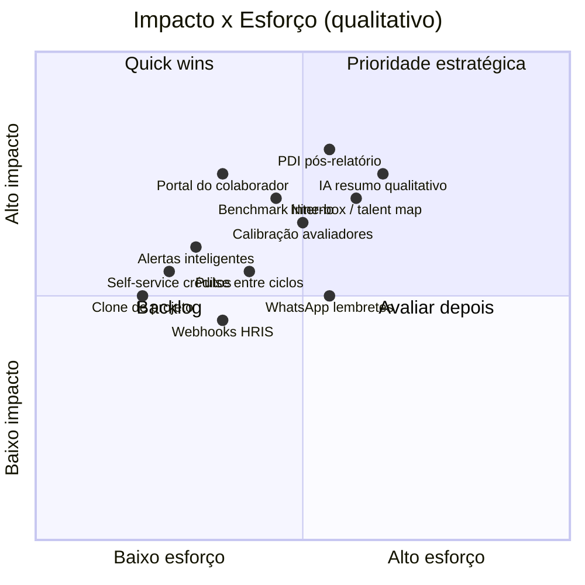

# ECK 360° — Roadmap de Features Inovadoras

> Documento estratégico com oportunidades de produto **plausíveis** com a base tecnológica e de negócio já existente no ECK (Angular 18, Firebase, Survey.js, créditos, competências, relatórios, e-mail/lembretes).
>
> **Data:** junho/2026 · **Público:** produto, negócio e engenharia

---

## 1. O que o ECK é hoje (síntese)

A ECK Consulting opera uma plataforma **multi-tenant B2B** de avaliação 360°:

| Dimensão | Situação atual |
|----------|----------------|
| **Modelo de receita** | Créditos (1 crédito ≈ 1 avaliado); pedidos aprovados manualmente pelo `admin_master` |
| **Ciclo operacional** | Cliente → projeto → participantes → envio por e-mail → preenchimento Survey.js → relatório PDF/DOCX/XLSX → publicação para `viewer` |
| **Diferenciais já construídos** | Competências agrupadas, editor visual de e-mail, lembretes agendados, relatórios ricos (Johari, gap, ECharts), white-label parcial, i18n (pt/en/es/fr/de) |
| **Papéis** | `admin_master` (ECK), `admin_client` (RH do cliente), `viewer` (gestor/consultor interno) |

O produto já cobre o **core operacional** de uma consultoria de RH. A inovação recomendada aqui não é “refazer a plataforma”, e sim **extrair mais valor dos dados, reduzir trabalho manual da consultoria e aumentar retenção do cliente** — usando o que já está no Firestore, nas Cloud Functions e no frontend.

---

## 2. Princípios para priorização

1. **Reutilizar antes de reinventar** — Survey.js, `releasedReports`, `competencyGroups`, lembretes e créditos já são alavancas.
2. **Monetizar onde já há dor** — créditos, relatórios e ciclos anuais são gatilhos naturais de upsell.
3. **Automatizar o que hoje é manual** — aprovação de pedidos, publicação de relatórios, calibração de respostas, follow-up pós-360.
4. **Dados agregados com privacidade** — benchmarks só com anonimização; LGPD como feature, não obstáculo.

---

## 3. Mapa de oportunidades

---

## 4. Features inovadoras (detalhamento)

### 🟢 Tier 1 — Quick wins (1–4 semanas cada)

Ideias de alto retorno usando módulos e coleções existentes.

#### 4.1 Clone inteligente de projeto

**O quê:** Duplicar projeto (assessment, grupos, estrutura de categorias de avaliadores, templates de e-mail e lembretes) sem copiar respostas — ideal para **ciclos anuais** de 360°.

**Valor de negócio:** Reduz setup de novo ciclo de horas para minutos; aumenta recorrência de créditos.

**Base técnica:** `projects`, `participants` (estrutura), `reminderSettings`, `mailTemplates`, `ProjectService`.

**Entrega mínima:** Botão “Duplicar projeto” em `ProjectsListComponent` + Cloud Function transacional.

---

#### 4.2 Self-service de créditos (com aprovação)

**O quê:** `admin_client` solicita pacote de créditos na plataforma; `admin_master` aprova/rejeita com um clique (fluxo já parcialmente modelado em `creditOrders`).

**Valor de negócio:** Menos e-mail/WhatsApp comercial; pipeline de vendas dentro do produto; notificação automática ao master.

**Base técnica:** `CreditOrdersComponent`, `NewCreditOrderComponent`, dashboard de créditos a vencer.

**Entrega mínima:** Formulário para client + status `Pendente` + fila no dashboard master.

---

#### 4.3 Centro de alertas proativos

**O quê:** Consolidar alertas já calculados no dashboard (`em_risco`, `atrasado`, links pendentes, créditos baixos) em um **feed acionável** com links diretos (“reenviar convite”, “estender prazo”, “concluir projeto”).

**Valor de negócio:** Consultoria atua antes do cliente reclamar; reduz projetos “mortos” sem resposta.

**Base técnica:** `DashboardComponent`, `assessmentLinks`, `projects.deadline`, `clients.credits`.

**Entrega mínima:** Widget + notificações in-app (Firestore `notifications` por `clientId`).

---

#### 4.4 Relatório executivo automático (1 página)

**O quê:** PDF de uma página gerado ao concluir projeto: taxa de resposta, top 3 competências fortes/fragilizadas, comparativo por categoria de avaliador — derivado do wizard de `ReportsComponent` sem exigir configuração manual.

**Valor de negócio:** Entrega rápida para C-level; diferencial comercial na proposta.

**Base técnica:** `generateReportPdf` (pdfmake), agregações já presentes em `reports/` e `assessments/dashboard`.

**Entrega mínima:** Template fixo + botão “Gerar resumo executivo” pós-conclusão.

---

#### 4.5 Webhooks pós-evento (HRIS / Slack / Teams)

**O quê:** Configurar URL por cliente para eventos: `assessment.completed`, `project.concluded`, `credits.low`.

**Valor de negócio:** Integração enterprise sem customização por cliente; abre porta para SAP, Totvs, Senior, etc.

**Base técnica:** Trigger `onAssessmentCompleted` já sincroniza créditos; estender com HTTP POST assinado.

**Entrega mínima:** Doc `clientWebhooks` + CF genérica de dispatch.

---

### 🟡 Tier 2 — Diferenciação (1–3 meses)

Features que mudam a percepção de “ferramenta de formulário” para **plataforma de people analytics**.

#### 4.6 Portal do colaborador (evolução do `viewer`)

**O quê:** Área onde o avaliado vê **seu histórico de ciclos** (somente relatórios publicados em `releasedReports`), evolução por competência e status do ciclo atual — sem ver dados de terceiros.

**Valor de negócio:** Engajamento pós-360; reduz “cadê meu feedback?”; suporta cultura de desenvolvimento contínuo.

**Base técnica:** `releasedReports`, `AuthService`, grupos por `userGroups`, gráficos ngx-charts/ECharts.

**Entrega mínima:** Rota `/meu-desenvolvimento` + timeline por `participantId` vinculado ao e-mail do usuário.

---

#### 4.7 PDI sugerido pós-relatório (Plano de Desenvolvimento Individual)

**O quê:** Após publicação do relatório, gerar **3–5 ações sugeridas** com base nas competências abaixo da média e comentários qualitativos (template + regras, sem IA na v1).

**Valor de negócio:** Fecha o loop feedback → ação; upsell de acompanhamento consultivo ECK.

**Base técnica:** `competencyGroups`, scores em `reports`, `GapChartComponent`, export DOCX editável.

**Entrega mínima:** Seção “Próximos passos” no PDF + checklist exportável; v2 com IA (ver 4.12).

---

#### 4.8 Calibração e qualidade das respostas

**O quê:** Painel que sinaliza avaliadores **outliers** (notas sempre extremas, tempo de preenchimento anômalo, padrão “tudo 5” ou “tudo 1”) antes de fechar o projeto.

**Valor de negócio:** Credibilidade metodológica do 360°; argumento de venda para RH exigente.

**Base técnica:** Subcoleção `assessments/{id}/results`, metadados de tempo (`completedAt`, progresso parcial).

**Entrega mínima:** Flags no `ParticipantsComponent` + relatório de calibração para master.

---

#### 4.9 Benchmark interno (anonimizado)

**O quê:** Comparar médias de competências **dentro do mesmo cliente** entre projetos/setores/cargos — nunca expondo indivíduos (mínimo N avaliados por célula).

**Valor de negócio:** “Como estamos vs. outras áreas?” sem comprar benchmark externo.

**Base técnica:** Agregações Firestore ou export BigQuery; gráficos radar já usados em reports.

**Entrega mínima:** Aba “Benchmark” no relatório com filtros setor/cargo e threshold de anonimização.

---

#### 4.10 Pulse 360° (micro-pesquisas entre ciclos)

**O quê:** Formulários curtos (3–5 itens Survey.js) disparados trimestralmente entre ciclos completos — **consome fração de crédito** ou pacote “pulse” separado.

**Valor de negócio:** Receita recorrente; mantém cliente ativo na plataforma o ano todo.

**Base técnica:** Mesmo fluxo `sendEmail` + `assessmentLinks`; assessment type `pulse` em `assessments`.

**Entrega mínima:** Tipo de projeto “Pulse” + template de survey enxuto + pricing de crédito fracionado.

---

#### 4.11 Nine-box / mapa de talentos

**O quê:** Matriz desempenho × potencial usando eixos configuráveis (ex.: média de competências de liderança vs. média geral), plotando avaliados de um projeto.

**Valor de negócio:** Linguagem familiar para RH; complementa relatório individual.

**Base técnica:** Dados agregados por participante em `ReportsComponent`; visualização ECharts scatter.

**Entrega mínima:** Modo de visualização no wizard de relatório + export PNG/PDF.

---

#### 4.12 Assistente de insights (IA sobre comentários abertos)

**O quê:** Resumir comentários qualitativos por competência (“temas recorrentes: comunicação, delegação…”) com LLM via Cloud Function — **opt-in por cliente**, dados não usados para treinar.

**Valor de negócio:** Escala análise qualitativa que hoje é manual na consultoria; feature premium.

**Base técnica:** Respostas textuais em `results.surveyData`; CF nova `summarizeQualitativeFeedback`.

**Entrega mínima:** Botão no relatório + cache do resumo em `reports/{id}.aiSummary`.

**Risco:** LGPD e política de IA — exigir termo de uso e anonimização de nomes antes do prompt.

---

### 🔵 Tier 3 — Visão estratégica (3–6+ meses)

#### 4.13 Marketplace de competências setoriais

**O quê:** Biblioteca ECK de `competencyGroups` prontos (varejo, financeiro, saúde) que o master importa para um cliente com um clique.

**Valor de negócio:** Time-to-value; padronização metodológica; possível cobrança por pacote de competências.

**Base técnica:** `competencies`, `competencyGroups`, seed em `collections/`.

---

#### 4.14 White-label completo + domínio customizado

**O quê:** Estender `ClientCustomizationComponent`: logo, cores, e-mail remetente por cliente, URL `avaliacao.cliente.com.br`, login branded.

**Valor de negócio:** ECK vira infraestrutura invisível; clientes enterprise pagam mais.

**Base técnica:** Firebase Hosting multi-site, templates de e-mail por `clientId`, `FRONTEND_URL` dinâmico na CF `sendEmail`.

---

#### 4.15 Canais alternativos de convite (WhatsApp / SMS)

**O quê:** Lembretes e convites via WhatsApp Business API ou SMS além de e-mail — especialmente útil para operacional e varejo.

**Valor de negócio:** ↑ taxa de resposta; diferencial vs. concorrentes só e-mail.

**Base técnica:** Mesma máquina de estados de `assessmentLinks`; nova CF `sendWhatsAppReminder` acionada pelo scheduler existente.

**Dependência:** Provedor externo (Twilio, Meta) + custo por mensagem.

---

#### 4.16 Modo facilitador ao vivo (calibração em workshop)

**O quê:** Tela para consultor ECK projetar resultados agregados **em tempo quase real** durante workshop de devolutiva, com blur de nomes até liberar.

**Valor de negócio:** Produto para entrega presencial/híbrida; valor percebido alto.

**Base técnica:** Dashboard analítico (`assessments/dashboard`), `releasedReports` com modo apresentação.

---

#### 4.17 Score de maturidade organizacional

**O quê:** Índice composto (0–100) por cliente/projeto: engajamento + dispersão de notas + evolução vs. ciclo anterior + cobertura de categorias de avaliadores.

**Valor de negócio:** KPI único para board; comparável entre anos.

**Base técnica:** Métricas já parcialmente no dashboard; fórmula configurável em `reportTemplates`.

---

## 5. Features transversais (habilitadores)

| Feature | Descrição | Por que agora |
|---------|-----------|---------------|
| **Créditos 100% server-side** | Reserva/consumo/estorno só via Cloud Functions | Segurança + base para pulse/benchmark |
| **Audit log unificado** | Trilha: quem enviou, cancelou, publicou relatório | Enterprise + LGPD |
| **Índices Firestore versionados** | `firestore.indexes.json` no repo | Performance em escala |
| **Completar stubs** | `/export`, `/upload-list`, `/emails-notifications` | UX prometida nas rotas |
| **Alinhar permissões** | `admin_client` criar projetos (já previsto em `permissions.config.ts`) | Reduz dependência da ECK no operacional |
| **Fila de e-mail** | SendGrid/SES em vez de Gmail único | Entregabilidade e escala |

---

## 6. Matriz de priorização sugerida

| # | Feature | Impacto | Esforço | Receita | Recomendação |
|---|---------|---------|---------|---------|--------------|
| 4.2 | Self-service créditos | Alto | Baixo | Direta | **Sprint 1** |
| 4.1 | Clone de projeto | Alto | Baixo | Indireta | **Sprint 1** |
| 4.3 | Alertas proativos | Médio | Baixo | Retenção | **Sprint 1** |
| 4.6 | Portal colaborador | Alto | Médio | Retenção | **Sprint 2** |
| 4.8 | Calibração respostas | Alto | Médio | Diferenciação | **Sprint 2** |
| 4.4 | Resumo executivo PDF | Médio | Baixo | Diferenciação | **Sprint 2** |
| 4.7 | PDI pós-relatório | Alto | Médio | Upsell consultoria | **Sprint 3** |
| 4.9 | Benchmark interno | Alto | Médio | Premium | **Sprint 3** |
| 4.10 | Pulse 360° | Alto | Médio | Nova linha receita | **Sprint 4** |
| 4.12 | IA comentários | Alto | Alto | Premium | **Piloto** |
| 4.15 | WhatsApp | Médio | Alto | Add-on | **Após estabilizar e-mail** |

---

## 7. Narrativa comercial (elevator pitch das inovações)

> *“O ECK deixa de ser só a plataforma onde você roda o 360° e passa a ser o **sistema nervoso de desenvolvimento de pessoas** do seu cliente: alerta riscos antes do prazo, mostra evolução ciclo a ciclo, sugere PDIs, calibra a qualidade do feedback e entrega insights executivos — tudo sobre a mesma base de competências e créditos que vocês já usam.”*

---

## 8. O que **não** recomendamos agora

- **Substituir Survey.js** por builder próprio — custo altíssimo, valor marginal.
- **App mobile nativo** — PWA/responsivo cobre avaliador; priorizar portal web.
- **Blockchain / NFT de certificados** — sem demanda do core B2B RH.
- **Social network interno** — distrai do fluxo 360°; pulse surveys resolvem engajamento com menos risco.

---

## 9. Próximos passos sugeridos

1. Validar com 2–3 clientes ativos quais dores pagariam (especialmente **clone de projeto**, **portal colaborador** e **PDI**).
2. Estimar créditos/precificação para **Pulse 360°** e **benchmark interno**.
3. Escolher 2 features Tier 1 para Q3 e detalhar épicos no backlog técnico.
4. Piloto fechado de **IA qualitativa** com um cliente e termo LGPD.

---

*Documento gerado com base na arquitetura atual: `src/app/pages/*`, `functions/src/index.ts`, coleções Firestore documentadas no README e fluxos de crédito/participantes/relatórios.*
